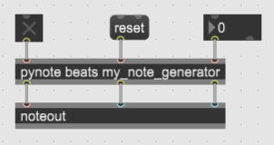

#### Like pygen, but output is in form that's good for a noteout object.

**Arguments:** _&lt; time-increment-type &gt;_ _&lt; generator-name &gt;_

_&lt; time-increment-type &gt;_ (non-optional)  
Must be "beats" or "ms." "beats" lets you control the tempo; "ms" is for fixed-time events.

_&lt; generator-name &gt;_ (non-optional)  
The name of Python generator added to Pymax with [pymax.add_generator]()

**Inlets:**  

+ Left: 1 starts, 0 stops the generator
+ Middle: for messages. Currently, "reset" is the only message.
+ Right: Int or float changes the tempo (bpm) if in "beats" mode

**Outlets:**  

+ Left: MIDI pitch
+ Middle: MIDI velocity
+ Right: MIDI channel
  
**Messages:**  

+ reset (no arguments)  
In middle inlet: resets the generator to its original state (technically, replaces the old instance of the generator with a newly constructed one).

See [playing_notes]() for examples of using this object.