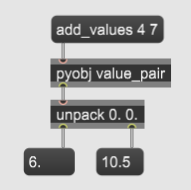

#### Sends messages to and receives messages from Python objects.
	
Get and set object member variables, and call object methods on the Python object whose name is the argument to this object.

**Argument:** _&lt; object-name &gt;_ (non-optional)  
Name of object added to Pymax

**Inlet:** Takes messages ('get' and 'set' methods, and function calls: see 'messages').

**Outlet:** Return value of function call (if any).  
If more than one value is returned, they must be returned in a Python list, not a tuple (that is, enclosed by square brackets, not parentheses). They will be output as a list in Max, which can be unpacked or manipulated by list-manipulation objects like [zl](https://docs.cycling74.com/max5/refpages/max-ref/zl.html). 

**Messages:**  

+ get _&lt; member-variable &gt;_  
Returns the value (through the outlet) of the argument (the member variable).

+ set _&lt; member-variable &gt;_  _&lt; value &gt;_  
Sets the value of the argument (the member variable) and returns the new value.

+ _&lt; member-function-name &gt;_ _&lt; argument-1 &gt;_ _&lt; argument-2 &gt;_ ...  
Calls the object method with the method name followed by any arguments it requires (can be no arguments).  Performs the function and returns the return value (if any) from the outlet.  

##### Example 1: Getting and setting a member variable

In Python:

```python
from pymaxmusic import pymax

class MyObject():
    def __init__(self):
        self.a = 2

pymax.open_pymax()
pymax.add_class("my_object", MyObject)
pymax.run_pymax()        
```


Then in Max:


##### Example 2: Calling an object method and also returning multiple values

In Python:
```Python
class ValuePair():
    def __init__(self):
        self.a = 2
        self.b = 3.5

    def add_values(self, a1, b1):
        return [self.a + a1, self.b + b1]

if __name__ == "__main__":

    from pymaxmusic import pymax

    pymax.open_pymax()
    pymax.add_class("value_pair", ValuePair)
    pymax.run_pymax()
```
Then in Max:
