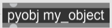
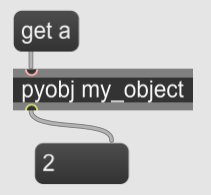
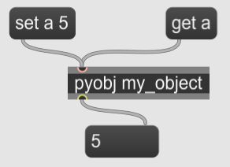

A Python object added to the Pymax system (using either pymax.add_object() or pymax.add_class()) with the name “my_object” can be called by pyobj object with the name as its only argument:

In Python:

```python
from pymaxmusic import pymax

class MyObject():
    def __init__(self):
        self.a = 2

pymax.open_pymax()
pymax.add_class("my_object", MyObject)
pymax.run_pymax()        
```


Then in Max:



You can get and set the object’s member variables using messages to the object:





Use a message to also call an object’s member function:

```python
from pymaxmusic import pymax

class MyObject():
    def __init__(self):
        self.a = 2
    def add_a(self, value):
        return self.a + value

pymax.open_pymax()
pymax.add_class("my_object", MyObject)
pymax.run_pymax()        
```

