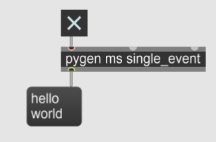

 Objects and generators that are added to the Pymax system in your Python code can be called by pyobj, pygen, and pynote Max objects in your Max patch.

The following Python code…

```python
from pymaxmusic import pymax

def single_event_generator():
    yield [1000, "hello world"]

pymax.open_pymax()
pymax.add_generator("say_hello", single_event_generator)    
pymax.run_pymax()
```

…will produce, after one second (1000 ms), the following Max output:




Basic usage is this:

1. Write a Python file that defines classes and generators and opens and runs pymax.
2. Write a Max patch that calls this Python file using pymax subpatchers (pyobj, pygen, pynote).
3. Run the Python file, either from your IDE or the command line.
4. Control the Python classes and get output in your Max patch.
5. To close Pymax, use Ctrl-C. A new pymax session won’t run until you close a previous one, due to udp port usage (you can get around this by setting different ports manually).

Note that any messages you send from Max will only be received by the Python side if run_pymax() has been called. So if you trigger messages in a max patch using loadbang or loadmess, these will not be received by Python unless run_pymax() has been called (that is, your module has started running) before these messages have been triggered (that is, before the Max patch has been opened).