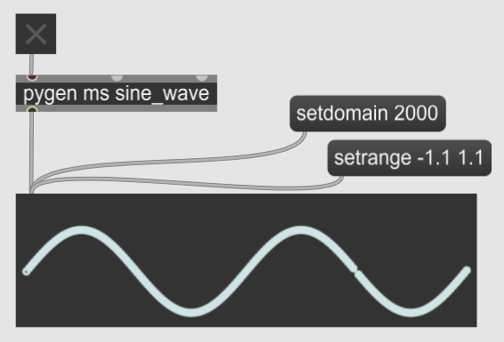
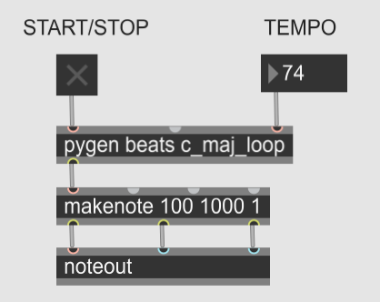

Generators are used in Pymax to produce events over time. You can have tempo-dependent events (metrical timing), or tempo-independent events (fixed time).

To send data to Max over time, write a generator that yields a list of the data. The only requirement for the list is that the first element must be the ontime at which this data will be sent.

Tempo-independent ontimes are measured in milliseconds. The following Python generator sends, every 12 milliseconds, the x and y values of a 1 Hz sine wave. There are thus three elements in the list that the generator yields:
1. The ontime (required) in milliseconds,
2. The x-value, which is just the ontime itself,
3. The y-value: sin(2𝜋 * time_in_seconds)

```python
import math

def sine_wave():
    ontime_in_ms = 0
    while True:
        yield [ontime_in_ms, ontime_in_ms, math.sin(2 * math.pi * ontime_in_ms/1000)]
        ontime_in_ms += 12

if __name__ == "__main__":

    from pymaxmusic import pymax

    pymax.open_pymax()
    pymax.add_generator("sine_wave", sine_wave)
    pymax.run_pymax()

```

To call this generator from max, create a pygen object. The pygen object takes two arguments, not one like the pyobj obj. The first argument is the type of time increment being used. There are two choices: ms for fixed-time events, and beats for tempo-dependent events. The second argument is the name of the generator.



#### Metrical Time and Tempo
To use metrical time, use “beats” as the first argument to the pygen object. When you do this, you can change the tempo by sending a number into the rightmost inlet of the pygen object (if you don’t set the tempo, by default it will be 60).
Then, in the Python generator, the first element of the list it yields (the ontime) should be in terms of beats. In the following example, the generator plays an ascending C major scale in an infinite loop. The ontime increases in increments of .5, meaning half a beat. So if the tempo is set at 60, the generator will play 120 notes every minute.

```python

def c_major_scale_loop():

    c_major_scale   = [60, 62, 64, 65, 67, 69, 71, 72]    
    ontime          = 0.0
    i               = 0

    while True:

        yield [ontime, c_major_scale[i]]

        i       = (i + 1) % len(c_major_scale)
        ontime  += .5

if __name__ == "__main__":

    from pymaxmusic import pymax

    pymax.open_pymax()
    pymax.add_generator("c_maj_loop", c_major_scale_loop)
    pymax.run_pymax()
```

